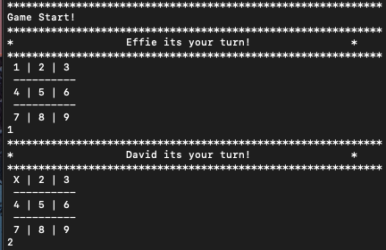
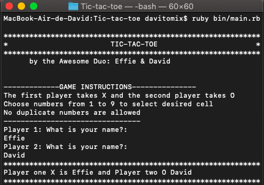

## TIC TAC TOE

This is an implementation of the Tic tac toe game in Ruby language. 

Tic tac toe is a game played by two players who take turns in fillimg the positions on the game board until there is a winner or until the board is full. The winner is the one who manages to have three of their marks in a straight line. If the board is full and there is no player with three of their markd in a straight line, then it's considered to be a draw.

## RULES
There was no UI created for this game so the game is played in the commandline after running the command ``ruby bin/main.rb`` within the project directory.

- Play occurs on a 3 by 3 grid of 9 squares.

- Two players take turns only in the empty squares, the first making X's, the second O's.

- A row is any three squares on the grid, adjacent, diagonally, vertically, or horizontally.

- If one player places three of the same marks in a row, the player WINS! :D

- If the spaces are all filled and there is no winner, the game ends in a draw. :( 

## INSTRUCTIONS

To start the game, in a terminal navigate to the root directory and type:

`ruby bin/main.rb`

or if using Windows you can simply run

`main.exe`

This is the starting screen of the game, here we have the header which includes the instructions for playing the game.

The first player who is player_one is asked to enter their name and is assigned to use letter `X` in the game while the second player who is player_two is assigned the letter 'O' once they have entered their names. 

On the main game state, we have a numbered board with numbers ranging from 1 to 9 and a message prompting for user input. Player 'X' starts typing a number from 1 to 9 and pressing enter. Player 'O' will then be prompted for a number from 1 to 9. 

If a player inputs an invalid number, he'll receive a warning and will be prompted for input again, until a valid value is provided. The game goes on until one of the players wins or when the board is full and we have a draw. 

The game will display the winner or a draw incase the board is full and there is no winner.

## AUTHORS
Made by the Awesome Duo 
- Github-> [@ampaire](https://github.com/ampaire)
- Twitter-> [@AmpaPhem](https://twitter.com/AmpaPhem)
- LinkedIn-> [Ampaire Phemia](https://www.linkedin.com/in/phemia) and 
- [David Garcia](https://github.com/davitomix)

## CONTRIBUTIONS

